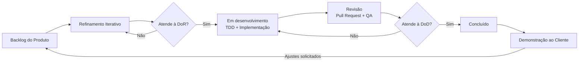

Unidade 02

## 9.1 Contextualização

A *Definition of Ready* (DoR) e a *Definition of Done* (DoD) são os acordos explícitos da equipe Bytelab que determinam, respectivamente, **quando um item do backlog pode entrar em desenvolvimento** e **quando um item pode ser considerado concluído**. Ambas formalizam as políticas de puxada e de saída descritas no [Processo de Validação](../unidade1/interacao.md) e são aplicadas sobre os cartões do GitHub Projects.

No ciclo do AUP adotado pelo projeto, as duas definições atuam como pontos de controle entre as fases e dentro de cada iteração:

* **DoR — verificação:** garante que a História de Usuário (US) produzida na Elaboração está completa, clara, priorizada e viável antes de ser comprometida em uma iteração de Construção. Responde à pergunta *"estamos construindo o produto certo, da forma certa especificada?"*.
* **DoD — validação:** garante que o incremento entregue atende aos critérios de aceitação, aos Requisitos Não Funcionais (RNFs) aplicáveis e foi aceito pelo cliente. Responde à pergunta *"o que foi construído atende à necessidade do cliente?"*.

Conforme o [Cronograma](../unidade1/cronograma.md), a verificação por DoR e a validação por DoD são executadas em todas as iterações da fase de Construção (Iterações 5 a 8), e a DoD de *release* é aplicada na fase de Transição (Iterações 9 e 10).

---

## 9.2 Definition of Ready (DoR)

Uma História de Usuário só pode ser movida da coluna **Backlog** para **Em desenvolvimento** no GitHub Projects quando **todos** os critérios abaixo forem atendidos. Caso algum critério não seja cumprido, a US retorna para refinamento e não é comprometida na iteração.

| ID | Critério | Descrição | Como verificar |
| :---: | :--- | :--- | :--- |
| **DoR01** | História bem escrita | A US está redigida no formato *"Como [ator], eu quero [ação] para que [valor]"*, com ator, objetivo e valor de negócio claros. | Revisão da US no cartão do GitHub Projects. |
| **DoR02** | Rastreabilidade definida | A US está vinculada ao(s) Requisito(s) Funcional(is) de origem e à Característica do Produto (CP) correspondente. | Conferência com a [lista de requisitos](requisitos.md) e a matriz OE × CP. |
| **DoR03** | Pertencimento ao MVP | A US compõe o escopo validado do MVP ou foi formalmente repriorizada com o cliente. | Conferência com os [requisitos aprovados para o MVP](MVP.md). |
| **DoR04** | Critérios de aceitação testáveis | A US possui critérios de aceitação objetivos e verificáveis, escritos no formato *Dado / Quando / Então*, que servirão de base para os testes do TDD. | Leitura cruzada por um Analista de QA. |
| **DoR05** | RNFs aplicáveis identificados | Os RNFs que restringem a US estão listados no cartão (ex.: RNF04 — Acessibilidade, RNF05 — Responsividade, RNF08 — Controle de acesso, RNF11 — Proteção de dados). | Conferência com a [especificação de RNFs](requisitos.md#requisitos-nao-funcionais). |
| **DoR06** | Regras de negócio e restrições legais esclarecidas | As regras de negócio, as restrições da LGPD e do ECA Digital e os ajustes solicitados pelo cliente que impactam a US estão registrados. | Conferência com os [ajustes solicitados pelo cliente](MVP.md#75-ajustes-solicitados-pelo-cliente). |
| **DoR07** | Protótipo associado | As telas e fluxos envolvidos na US estão representados no protótipo navegável e foram revisados pela equipe. | Link do protótipo (Figma) anexado ao cartão. |
| **DoR08** | Esforço estimado e compatível | A US possui esforço técnico estimado na escala de 1 a 4 e cabe em uma iteração. Itens com esforço **4 (Muito Alto)** devem ser divididos antes de entrar em desenvolvimento. | Conferência com a estimativa registrada na [Iteração 3](../aup-elaboracao/iteracao3.md). |
| **DoR09** | Dependências mapeadas | Dependências técnicas e funcionais com outras US foram identificadas e estão resolvidas ou planejadas na mesma iteração (ex.: autenticação antes da pré-reserva). | Discussão no refinamento iterativo. |
| **DoR10** | Dúvidas resolvidas | Não há perguntas em aberto sobre a US; quando necessário, o esclarecimento com o cliente foi obtido e registrado. | Registro no cartão ou no canal oficial de comunicação. |
| **DoR11** | Responsáveis definidos | A US possui ao menos um responsável pela implementação e um revisor designados. | Campos de responsável preenchidos no GitHub Projects. |

!!! info "Princípio INVEST"
    Além do checklist acima, a equipe utiliza o princípio **INVEST** como apoio na escrita e no refinamento das histórias: cada US deve ser **I**ndependente, **N**egociável, **V**aliosa, **E**stimável, pequena (***S**mall*) e **T**estável. Histórias que não atendem a esses atributos tendem a falhar nos critérios DoR04, DoR08 e DoR09.

---

## 9.3 Definition of Done (DoD)

A DoD é organizada em três níveis, acompanhando a granularidade das entregas do AUP: a **História de Usuário**, o **incremento da iteração** e a **release** do produto.

### 9.3.1 DoD da História de Usuário

Uma US só pode ser movida para a coluna **Concluído** quando **todos** os critérios abaixo forem atendidos:

| ID | Critério | Descrição | Como verificar |
| :---: | :--- | :--- | :--- |
| **DoD01** | Critérios de aceitação atendidos | Todos os critérios de aceitação definidos na DoR foram implementados e demonstrados. | Execução dos cenários *Dado / Quando / Então*. |
| **DoD02** | Testes automatizados aprovados | Os testes unitários e de integração da funcionalidade foram escritos seguindo o TDD e estão passando. | Relatório de execução dos testes. |
| **DoD03** | Revisão de código | O código foi submetido via *Pull Request* e revisado e aprovado por ao menos um integrante que não participou da implementação. | Aprovação registrada no *Pull Request*. |
| **DoD04** | Integração contínua aprovada | O *build* foi concluído sem erros no pipeline de CI e o código foi integrado à branch principal sem conflitos. | Status do pipeline no GitHub. |
| **DoD05** | Conformidade com o protótipo | A interface implementada segue o protótipo validado, com revisão visual feita pela equipe. | Comparação entre a tela implementada e o protótipo. |
| **DoD06** | Acessibilidade e responsividade | Os fluxos da US atendem às recomendações aplicáveis da WCAG 2.1 AA (RNF04) e permanecem utilizáveis entre 360 px e 1920 px de largura, sem rolagem horizontal (RNF05). | Inspeção com ferramenta de auditoria de acessibilidade e teste em diferentes resoluções. |
| **DoD07** | Segurança e privacidade | O controle de acesso por perfil está aplicado inclusive às rotas e *endpoints* (RNF08) e nenhum dado pessoal é exposto fora do fluxo previsto, como o CPF do produtor (RNF11 e RNF15). | Teste de acesso direto às rotas com perfis distintos. |
| **DoD08** | Tratamento de erros | Entradas inválidas exibem mensagens de validação ou orientação ao usuário (RNF03) e dados de formulários não são perdidos em caso de falha de conexão (RNF07), quando aplicável. | Execução de cenários de erro. |
| **DoD09** | Sem defeitos críticos | Não há defeitos conhecidos de severidade alta ou crítica associados à US. | Registro de *issues* no GitHub. |
| **DoD10** | Documentação e rastreabilidade atualizadas | O status da US no backlog, a matriz de rastreabilidade e as evidências da iteração no GitPages foram atualizados. | Conferência da documentação publicada. |

### 9.3.2 DoD da Iteração

Uma iteração da fase de Construção é considerada concluída quando:

| ID | Critério | Descrição |
| :---: | :--- | :--- |
| **DoD-I01** | Histórias concluídas ou devolvidas | Todas as US comprometidas atendem à DoD da História de Usuário; as que não atenderem retornam ao backlog para repriorização. |
| **DoD-I02** | Incremento integrado e implantado | O incremento está integrado e disponível em ambiente de homologação na nuvem, acessível ao cliente. |
| **DoD-I03** | Demonstração ao cliente | O incremento foi apresentado ao cliente em reunião de revisão, conforme o [Processo de Validação](../unidade1/interacao.md). |
| **DoD-I04** | Feedback registrado | O aceite ou as solicitações de ajuste do cliente foram registrados, respeitando o prazo de feedback de até 3 dias úteis. |
| **DoD-I05** | Backlog repriorizado | Ajustes e novas necessidades identificados foram incluídos no backlog e repriorizados para as próximas iterações. |
| **DoD-I06** | Evidências publicadas | As evidências da iteração (prints, vídeos, registros de decisão) foram publicadas na página da respectiva iteração. |

### 9.3.3 DoD da Release

Na fase de Transição, o produto é considerado pronto para entrega à comunidade da Cafuringa quando:

| ID | Critério | Descrição |
| :---: | :--- | :--- |
| **DoD-R01** | MVP completo | Todos os requisitos funcionais e não funcionais aprovados para o MVP atendem à DoD da História de Usuário. |
| **DoD-R02** | Testes de aceitação aprovados | Os Testes de Aceitação de Usuário foram executados em ambiente de homologação com o cliente e representantes dos usuários, sem não conformidades impeditivas. |
| **DoD-R03** | Requisitos de qualidade verificados | Os critérios verificáveis dos RNFs de desempenho em conectividade limitada (RNF06), proteção da comunicação via HTTPS (RNF10) e baixo custo operacional (RNF13) foram verificados no ambiente final. |
| **DoD-R04** | Aceite formal do cliente | O Termo de Aceite do Produto foi assinado pelo cliente. |
| **DoD-R05** | Implantação em produção | A versão final foi implantada em produção e está acessível publicamente. |
| **DoD-R06** | Encerramento documentado | A documentação *as-built*, o registro de entrega e o backlog residual (requisitos destinados a entregas futuras) foram publicados. |

---

## 9.4 DoR e DoD no Ciclo do AUP

O fluxo abaixo representa como uma História de Usuário percorre o quadro do GitHub Projects, passando pelos pontos de controle da DoR e da DoD:

A tabela a seguir relaciona a aplicação das definições a cada fase do AUP e ao respectivo marco:

| Fase | Papel da DoR | Papel da DoD | Marco associado |
| :--- | :--- | :--- | :--- |
| **Concepção** | Não aplicada — o foco está na visão do produto, nos OEs e nas CPs. | Não aplicada. | Objetivos do ciclo de vida definidos. |
| **Elaboração** | **Construção da DoR:** as US são escritas, estimadas, priorizadas e prototipadas até atenderem aos critérios de prontidão. | Definição dos critérios de DoD que serão aplicados na Construção. | Arquitetura do ciclo de vida e MVP aprovado. |
| **Construção** | **Verificação:** aplicada no planejamento de cada iteração para selecionar as US que serão comprometidas. | **Validação:** aplicada a cada US (9.3.1) e ao final de cada iteração (9.3.2). | Capacidade operacional inicial. |
| **Transição** | Aplicada apenas a correções e ajustes decorrentes da homologação. | **DoD da Release** (9.3.3) aplicada à versão candidata. | Release do produto. |

---

## 9.5 Responsabilidades

| Momento | Responsável | Atividade |
| :--- | :--- | :--- |
| Refinamento iterativo | Analistas de Requisitos | Garantir que as US atendam aos critérios DoR01 a DoR10. |
| Planejamento da iteração | Gerente de projeto/facilitador | Confirmar a DoR e autorizar a entrada das US na iteração. |
| Revisão do *Pull Request* | Desenvolvedores revisores e Analistas de QA | Verificar os critérios DoD01 a DoD09. |
| Atualização da documentação | Analistas de Requisitos | Garantir o critério DoD10 e as evidências da iteração. |
| Reunião de revisão | Cliente (Jefferson Sooma) e equipe completa | Validar o incremento e registrar o aceite ou os ajustes (DoD-I03 e DoD-I04). |
| Homologação final | Cliente, representantes dos usuários e equipe completa | Aplicar a DoD da Release. |

---

## 9.6 Revisão das Definições

A DoR e a DoD não são artefatos estáticos. Ao final de cada iteração, durante a análise das lições aprendidas, a equipe avalia se os critérios estão adequados à realidade do projeto e, quando necessário, os ajusta. Toda alteração é registrada nesta página e passa a valer a partir da iteração seguinte, sem afetar itens já em andamento.
